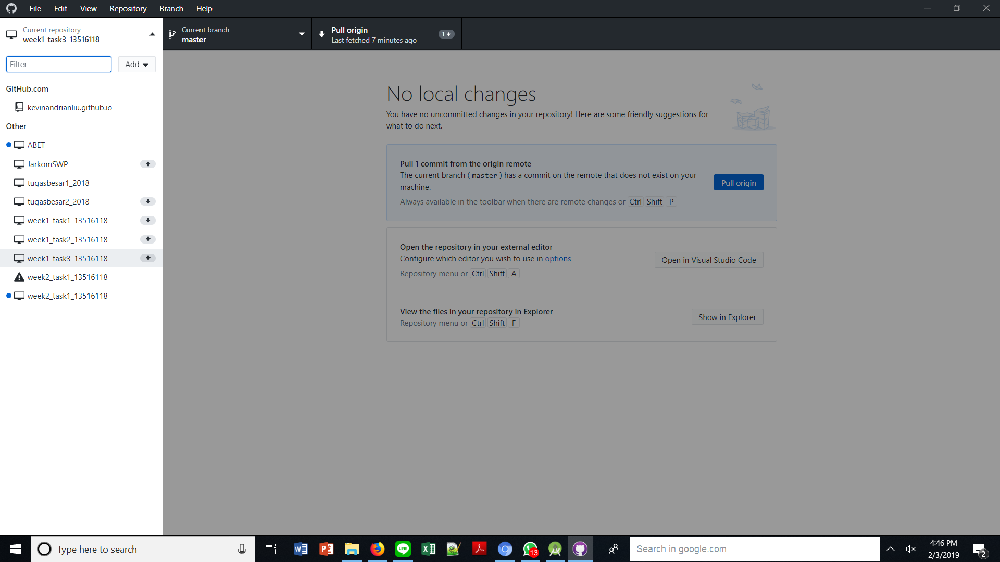

# Week2_Task1_13516118

## Notes
1. I'm sorry my commit is actually only 4(there are several mistakes in updating the readme). Actually, I've already done committing for more than 10 times in total, but my local repository is broken down 5 hours before submission. I decided to move my local repository and reduce my commits. Here is the screenshot of the error: 
2. This repository is used as the answers for version 1 of Android Developer Fundamental Course-Practicals, and there are 3 folders here, Tab Experiment for Lesson 4.3(#Assignment 1), Recycler View(#Assignment 2), and Material Me for Lesson 5.2(#Assignment 3)

## Author
Kevin Andrian Liwinata
K1
13516118
Teknik Informatika

